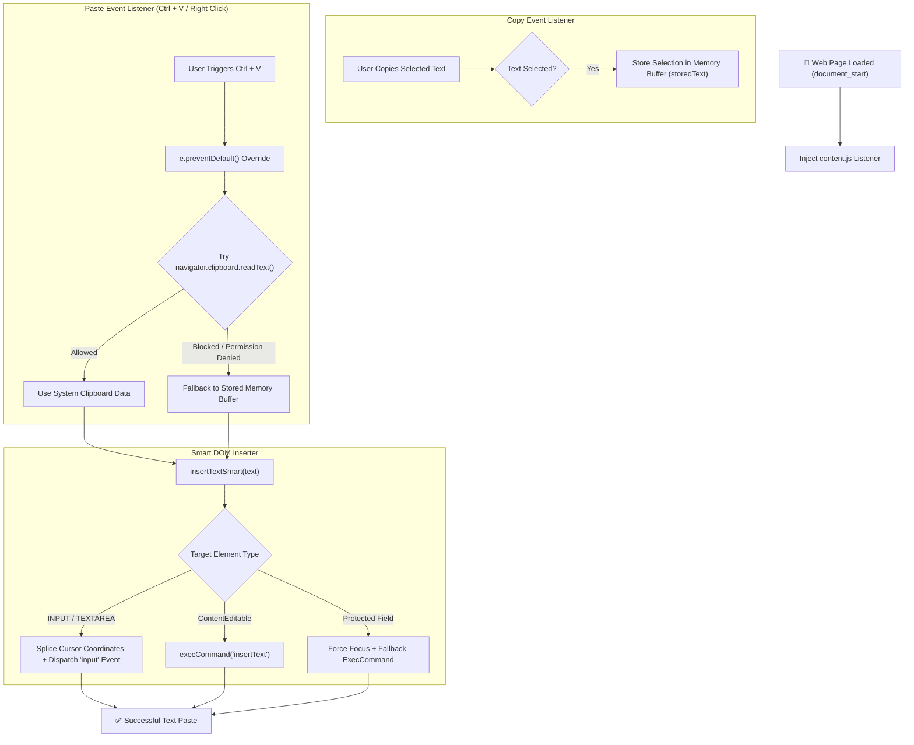

<div align="center">

  <h1>✨ Yuvi Master — Smart Copy & Paste Chrome Extension</h1>

  <p align="center">
    <strong>A lightweight Manifest V3 Chrome Extension designed to bypass copy-paste restrictions, enable smart clipboard fallback, and force text insertion on protected web forms and text areas.</strong>
  </p>

  <p align="center">
    <a href="https://github.com/SINGH0883/Yuvi-Master">
      
    </a>
    <a href="https://github.com/SINGH0883/Yuvi-Master">
      
    </a>
    <a href="https://github.com/SINGH0883/Yuvi-Master">
      
    </a>
    <a href="https://github.com/SINGH0883/Yuvi-Master/blob/main/LICENSE">
      
    </a>
  </p>

</div>

<hr />

## 🌟 Overview

**Yuvi Master** is a high-utility browser extension that restores full copy and paste functionality on web pages that restrict standard clipboard operations (such as online test portals, locked form inputs, or disabled text fields).

By capturing text selections at document execution and providing a dual-buffer fallback engine, **Yuvi Master** ensures your copied text is injected seamlessly into standard `<input>`, `<textarea>`, or `contenteditable` elements.

---

## 🔄 Architecture Workflow Chart



---

## ⚡ Core Features

* **🛡️ Bypasses Copy & Paste Restrictions:** Overrides `disabled` paste event handlers, blocked context menus, and custom website script restrictions.
* **💾 Dual-Buffer Fallback System:** Automatically caches highlighted text selections in extension memory. If browser security blocks `navigator.clipboard`, the extension falls back to memory storage.
* **🎯 Universal DOM Insertion Engine:**
  * **Input & Textarea:** Injects text precisely at current cursor position (`selectionStart`/`selectionEnd`) and dispatches native reactive `input` events for compatibility with React, Vue, Angular, and Svelte forms.
  * **ContentEditable Elements:** Uses native text insertion command for rich text editors.
  * **Protected Fields:** Automatically forces element focus before execution.
* **✨ Clean White Welcome Popup:** Minimalist, modern rounded welcome pop-up card UI with smooth hover animations and responsive typography.

---

## 💻 How to Install on Your Computer

Follow these quick steps to install **Yuvi Master** on any Chromium-based browser (**Google Chrome**, **Microsoft Edge**, **Brave**, **Vivaldi**, or **Opera**):

### Step 1: Download or Clone the Repository
* **Option A (Git):** Open your terminal/command prompt and run:
  ```bash
  git clone https://github.com/SINGH0883/Yuvi-Master.git
  ```
* **Option B (ZIP):** Download the repository ZIP file from GitHub and extract it to a folder on your computer.

---

### Step 2: Open Extensions Page in Your Browser
Open your preferred browser and navigate to the Extensions management page:
* **Google Chrome:** Type `chrome://extensions/` in the address bar and press **Enter**.
* **Microsoft Edge:** Type `edge://extensions/` in the address bar and press **Enter**.
* **Brave:** Type `brave://extensions/` in the address bar and press **Enter**.
* **Opera:** Type `opera://extensions` in the address bar and press **Enter**.

---

### Step 3: Enable Developer Mode
In the top right corner of the Extensions page, toggle the **Developer mode** switch to **ON** (Enabled).

```
Developer mode  [  ON  ]
```

---

### Step 4: Load the Unpacked Extension
1. Click the **"Load unpacked"** button that appears in the top left control bar.
2. A file picker window will open. Select the `Yuvi-Master` folder containing `manifest.json`.
3. Click **Select Folder**.

---

### Step 5: Pin & Enjoy!
* Click the Extensions puzzle icon (🧩) in your browser toolbar next to the address bar.
* Find **Yuvi Master** and click the **Pin** icon (📌).
* You're all set! Now you can copy and paste freely across any web page!

---

## 🛠️ Project Structure

```
Yuvi-Master/
├── manifest.json      # Chrome Extension Manifest V3 Configuration
├── content.js         # Core Copy-Paste Listener & DOM Inserter Script
├── popup.html         # Glassmorphic Popup Interface
├── popup.js           # Extension Popup Logic
├── icon.png           # Extension Toolbar & Store Icon
└── README.md          # Project Documentation & Installation Guide
```

---

## 📬 Author & License

**Yuvraj Singh** — *AI & Data Science Engineer \| Full-Stack Developer*

* 🌐 **GitHub:** [@SINGH0883](https://github.com/SINGH0883)
* 💼 **LinkedIn:** [Yuvraj Singh](https://www.linkedin.com/in/yuvraj-singh-85abc)

Licensed under the [MIT License](LICENSE).
