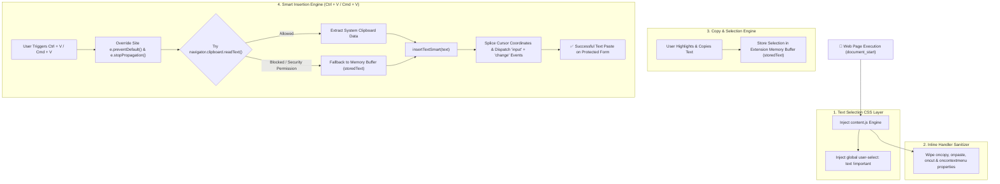

<div align="center">

  

  <h1 style="font-size: 2.2rem; font-weight: 800; margin-top: 12px;">✨ Yuvi Master</h1>

  <p align="center">
    <strong>The Ultimate Universal Copy & Paste Enabler Chrome Extension (Manifest V3)</strong>
  </p>

  <p align="center">
    <em>Bypass copy-paste restrictions, unlock text selection, and force text insertion on protected forms across any website automatically — zero configuration required!</em>
  </p>

  <p align="center">
    <a href="https://github.com/SINGH0883/Yuvi-Master">
      
    </a>
    <a href="https://github.com/SINGH0883/Yuvi-Master">
      
    </a>
    <a href="https://github.com/SINGH0883/Yuvi-Master">
      
    </a>
    <a href="https://github.com/SINGH0883/Yuvi-Master/blob/main/LICENSE">
      
    </a>
  </p>

</div>

<hr />

## 📖 Table of Contents

- [🌟 Overview](#-overview)
- [⚡ Key Features](#-key-features)
- [🔄 System Architecture & Workflow](#-system-architecture--workflow)
- [🔬 Technical Implementation Matrix](#-technical-implementation-matrix)
- [🌐 Supported Frameworks & Browsers](#-supported-frameworks--browsers)
- [💻 Step-by-Step Installation Guide](#-step-by-step-installation-guide)
- [🛠️ Project File Structure](#️-project-file-structure)
- [📬 Author & License](#-author--license)

---

## 🌟 Overview

**Yuvi Master** is a high-performance, lightweight Chromium extension engineered to **restore full copy, cut, and paste functionality** on web pages that impose aggressive clipboard restrictions (such as online test portals, locked form inputs, disabled text boxes, or copy-protected documentation).

Built on Manifest V3, **Yuvi Master** operates silently in the background on every site you visit. It neutralizes restrictive event handlers, forces CSS text selection capability, and injects copied text directly into active input fields while triggering native reactive form events for full compatibility with modern web applications.

---

## ⚡ Key Features

| Feature | Description |
| :--- | :--- |
| **⚡ Universal Always-On Engine** | Works out-of-the-box on 100% of websites automatically without needing setup, complex settings, or ON/OFF toggles. |
| **🛡️ Bypasses Script Restrictions** | Overrides `disabled` paste handlers, blocked context menus (`right-click`), and custom JS key interceptors. |
| **💾 Dual-Buffer Fallback System** | Automatically caches copied text selections in an internal extension memory buffer. If browser security blocks `navigator.clipboard`, the extension seamlessly falls back to memory. |
| **🎯 Reactive Form Insertion** | Injects text precisely at cursor coordinates (`selectionStart`/`selectionEnd`) and dispatches native `input` & `change` events for React, Vue, Angular, and Svelte compatibility. |
| **🔓 Text Selection CSS Enforcer** | Dynamically injects `user-select: text !important` to ensure text selection is never hidden or blocked by site stylesheets. |
| **✨ Modern Glassmorphic Popup** | Clean, minimalist rounded popup card interface featuring active domain detection and slick typography. |

---

## 🔄 System Architecture & Workflow



---

## 🔬 Technical Implementation Matrix

| Module | Core Logic | Implementation Details |
| :--- | :--- | :--- |
| **Selection Enforcer** | `enableTextSelectionCSS()` | Injects `<style>` tag containing `* { user-select: text !important; }` to override site CSS rules blocking text highlighting. |
| **Handler Sanitizer** | `unblockInlineHandlers()` | Periodically sets `document.oncopy`, `document.onpaste`, `document.oncontextmenu` to `null` to disable inline blocking scripts. |
| **Capture Listener** | `addEventListener(..., true)` | Uses capture-phase event listeners (`useCapture = true`) to catch `Ctrl/Cmd + C/V/X` keydown events before site scripts receive them. |
| **Reactive DOM Splicer** | `insertTextSmart()` | Slices input string at `selectionStart` and `selectionEnd`, updates element value, and fires `Event("input")` & `Event("change")` with event bubbling. |

---

## 🌐 Supported Frameworks & Browsers

### 🚀 Compatible Form Frameworks
Compatible with all major frontend frameworks and native web form controls:
* **React.js & Next.js** (Synthetic event system compatible)
* **Vue.js & Nuxt.js** (`v-model` reactive state compatible)
* **Angular** (`ngModel` control compatible)
* **Svelte & SvelteKit** (`bind:value` compatible)
* **Standard HTML5 Forms** (`<input>`, `<textarea>`, `[contenteditable]`)

### 🌐 Compatible Browsers
Works seamlessly across all Chromium-based browsers:
* **Google Chrome** (v88+)
* **Microsoft Edge** (v88+)
* **Brave Browser**
* **Vivaldi Browser**
* **Opera & Opera GX**

---

## 💻 Step-by-Step Installation Guide

Follow these quick steps to install **Yuvi Master** on your computer in under 1 minute:

### Step 1: Download or Clone the Repository
* **Option A (Git):** Open your terminal and run:
  ```bash
  git clone https://github.com/SINGH0883/Yuvi-Master.git
  ```
* **Option B (ZIP):** Download the repository ZIP file from GitHub and extract it to a folder on your computer.

---

### Step 2: Open Extensions Page in Your Browser
Open your Chromium browser and navigate to the Extensions page:
* **Google Chrome:** `chrome://extensions/`
* **Microsoft Edge:** `edge://extensions/`
* **Brave:** `brave://extensions/`
* **Opera:** `opera://extensions/`

---

### Step 3: Enable Developer Mode
Toggle the **Developer mode** switch in the top-right corner to **ON**:

```
Developer mode  [  ON  ]
```

---

### Step 4: Load Unpacked Extension
1. Click the **"Load unpacked"** button in the top toolbar.
2. Select the `Yuvi-Master` folder containing `manifest.json`.
3. Click **Select Folder**.

---

### Step 5: Pin & Enjoy!
* Click the Extensions puzzle icon (🧩) in your browser toolbar.
* Find **Yuvi Master** and click the **Pin** icon (📌).
* You're all set! Copy and paste freely anywhere on the web!

---

## 🛠️ Project File Structure

```
Yuvi-Master/
├── manifest.json      # Manifest V3 Extension Configuration & Permissions
├── content.js         # Core Copy-Paste Listener, Selection Enforcer & DOM Inserter
├── popup.html         # Sleek Glassmorphic Control Interface
├── popup.js           # Extension Popup Script & Domain Detector
├── icon.png           # Extension Branding & Store Icon
└── README.md          # Complete Project Documentation
```

---

## 📬 Author & License

**Yuvraj Singh** — *AI & Data Science Engineer \| Full-Stack Developer*

* 🌐 **GitHub:** [@SINGH0883](https://github.com/SINGH0883)
* 💼 **LinkedIn:** [Yuvraj Singh](https://www.linkedin.com/in/yuvraj-singh-85abc)

Licensed under the [MIT License](LICENSE).
