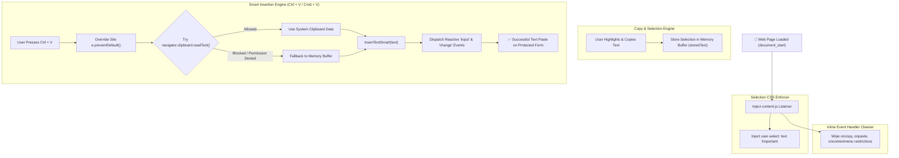

<div align="center">

  <h1>✨ Yuvi Master — Universal Copy & Paste Enabler</h1>

  <p align="center">
    <strong>A lightweight Manifest V3 Chrome Extension designed to automatically bypass copy-paste restrictions, unblock text selection, and force text insertion on protected web forms across all websites.</strong>
  </p>

  <p align="center">
    <a href="https://github.com/SINGH0883/Yuvi-Master">
      
    </a>
    <a href="https://github.com/SINGH0883/Yuvi-Master">
      
    </a>
    <a href="https://github.com/SINGH0883/Yuvi-Master">
      
    </a>
    <a href="https://github.com/SINGH0883/Yuvi-Master/blob/main/LICENSE">
      
    </a>
  </p>

</div>

<hr />

## 🌟 Overview

**Yuvi Master** is a high-utility browser extension that restores full copy and paste functionality on web pages restricting standard clipboard operations (such as online examination portals, locked form inputs, disabled text fields, or protected articles).

Operating automatically in the background on every web page, **Yuvi Master** overrides restrictive site scripts, enables text selection, wipes inline event blocks, and injects copied text into any `<input>`, `<textarea>`, or `contenteditable` element using a dual-buffer fallback engine.

---

## 🔄 Architecture Workflow Chart



---

## ⚡ Core Features

* **⚡ Universal Always-On Engine:** Automatically enables copy and paste across **all websites** without needing any manual setup or ON/OFF toggle switches.
* **🛡️ Bypasses Copy & Paste Restrictions:** Overrides `disabled` paste event handlers, blocked context menus, and custom website script restrictions.
* **💾 Dual-Buffer Fallback System:** Automatically caches highlighted text selections in extension memory. If browser security blocks `navigator.clipboard`, the extension seamlessly falls back to memory storage.
* **🎯 Reactive Form Insertion:** Injects text precisely at current cursor position (`selectionStart`/`selectionEnd`) and dispatches native reactive `input` and `change` events for full compatibility with React, Vue, Angular, and Svelte forms.
* **✨ Clean Popup Interface:** Minimalist rounded popup card UI displaying active website status and brand branding.

---

## 🔬 How It Works Under The Hood

| Mechanism | Description |
| :--- | :--- |
| **CSS Selection Injection** | Injects `user-select: text !important` dynamically into document head so websites cannot disable text highlighting. |
| **Inline Handler Sanitizer** | Periodically nullifies `oncopy`, `onpaste`, `oncut`, `oncontextmenu`, and `onselectstart` inline properties set by restrictive scripts. |
| **Capture-Phase Interception** | Uses event listeners with `useCapture = true` to stop event propagation before website scripts can block key combinations (`Ctrl/Cmd + C/V/X`). |
| **Reactive DOM Dispatcher** | Triggers native `input` and `change` events after text splicing, allowing form validation scripts in modern web frameworks (React, Vue, Angular) to register pasted values. |

---

## 💻 How to Install on Your Computer

Follow these quick steps to install **Yuvi Master** on any Chromium-based browser (**Google Chrome**, **Microsoft Edge**, **Brave**, **Vivaldi**, or **Opera**):

### Step 1: Download or Clone the Repository
* **Option A (Git):** Open your terminal/command prompt and run:
  ```bash
  git clone https://github.com/SINGH0883/Yuvi-Master.git
  ```
* **Option B (ZIP):** Download the repository ZIP file from GitHub and extract it to a folder on your computer.

---

### Step 2: Open Extensions Page in Your Browser
Open your preferred browser and navigate to the Extensions management page:
* **Google Chrome:** Type `chrome://extensions/` in the address bar and press **Enter**.
* **Microsoft Edge:** Type `edge://extensions/` in the address bar and press **Enter**.
* **Brave:** Type `brave://extensions/` in the address bar and press **Enter**.
* **Opera:** Type `opera://extensions` in the address bar and press **Enter**.

---

### Step 3: Enable Developer Mode
In the top right corner of the Extensions page, toggle the **Developer mode** switch to **ON** (Enabled).

```
Developer mode  [  ON  ]
```

---

### Step 4: Load the Unpacked Extension
1. Click the **"Load unpacked"** button that appears in the top left control bar.
2. A file picker window will open. Select the `Yuvi-Master` folder containing `manifest.json`.
3. Click **Select Folder**.

---

### Step 5: Pin & Enjoy!
* Click the Extensions puzzle icon (🧩) in your browser toolbar next to the address bar.
* Find **Yuvi Master** and click the **Pin** icon (📌).
* Enjoy unrestricted copy and paste capabilities across all websites!

---

## 🛠️ Project Structure

```
Yuvi-Master/
├── manifest.json      # Chrome Extension Manifest V3 Configuration
├── content.js         # Universal Copy-Paste Enabler & DOM Inserter Script
├── popup.html         # Modern Control Panel Interface
├── popup.js           # Extension Popup Script
├── icon.png           # Extension Toolbar & Store Icon
└── README.md          # Project Documentation & Installation Guide
```

---

## 📬 Author & License

**Yuvraj Singh** — *AI & Data Science Engineer \| Full-Stack Developer*

* 🌐 **GitHub:** [@SINGH0883](https://github.com/SINGH0883)
* 💼 **LinkedIn:** [Yuvraj Singh](https://www.linkedin.com/in/yuvraj-singh-85abc)

Licensed under the [MIT License](LICENSE).
